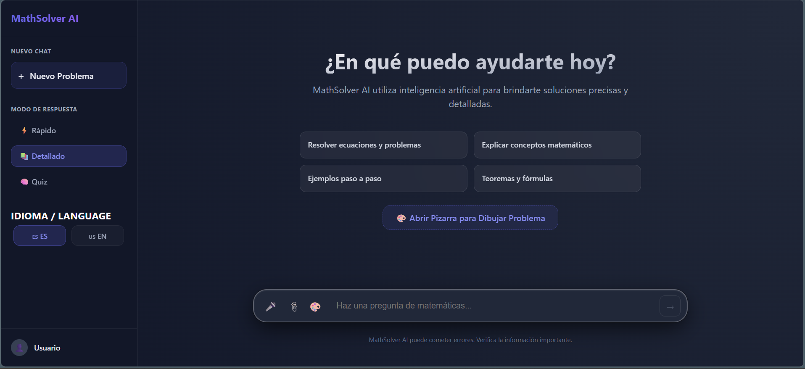
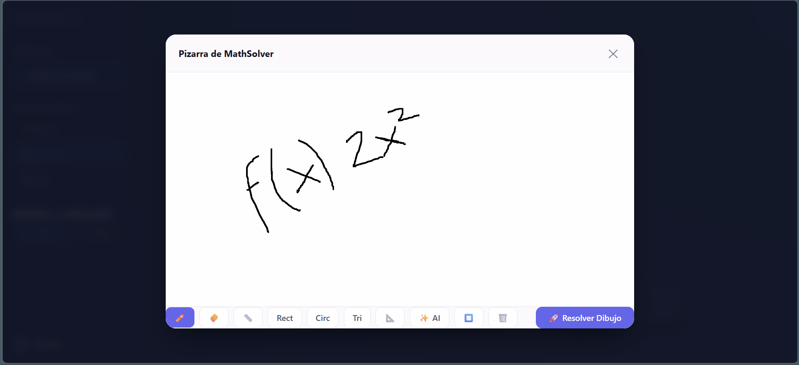
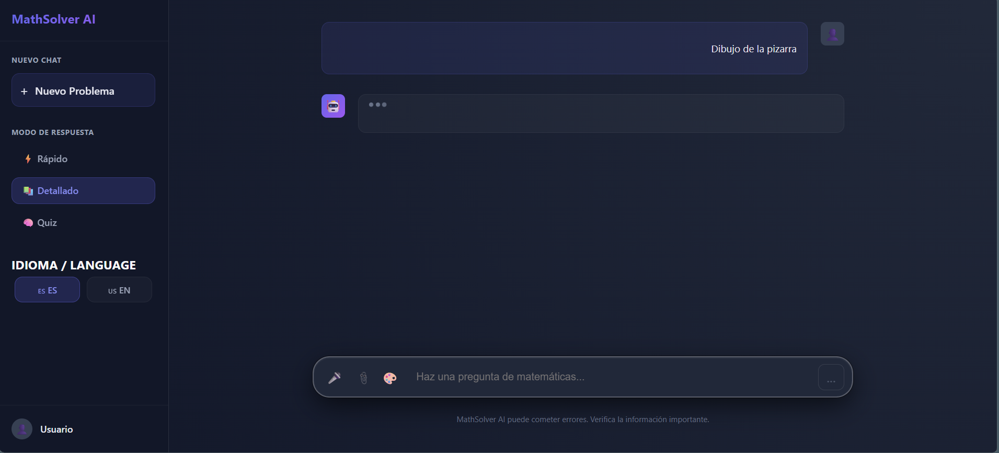
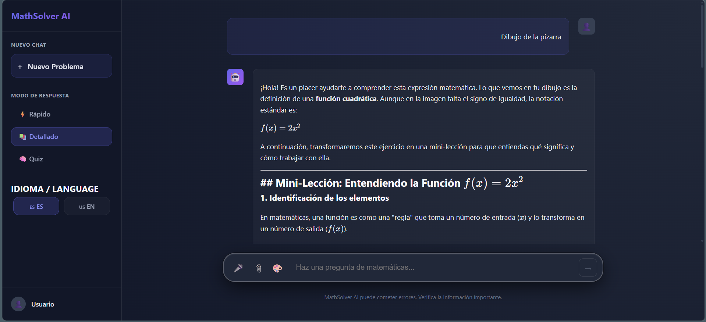
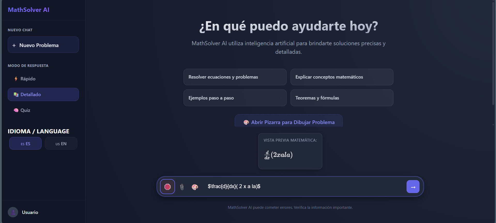
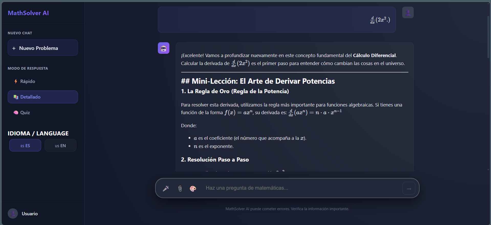
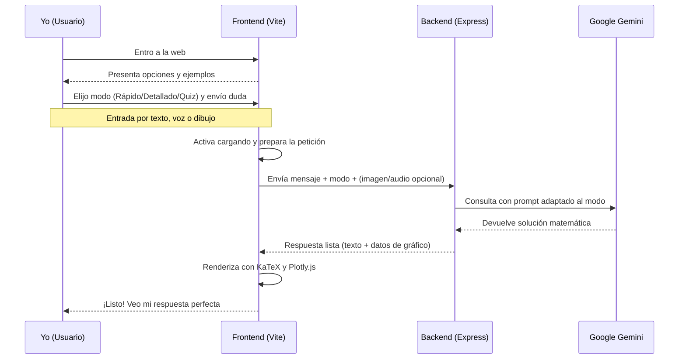
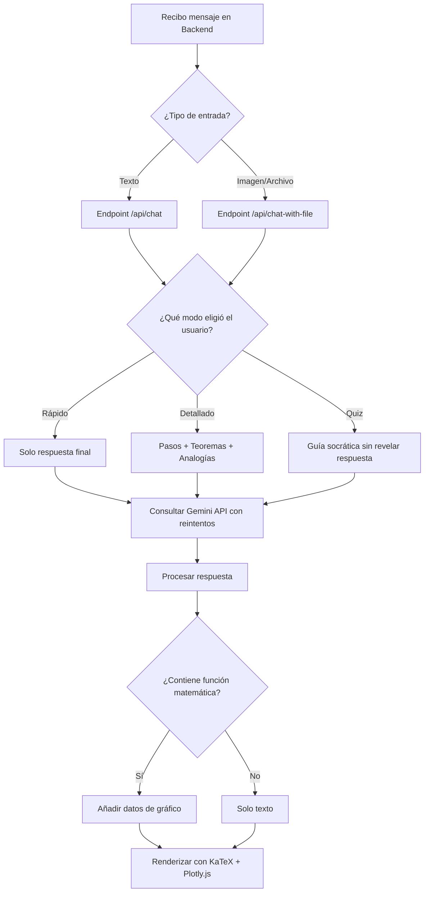

# MathSolver AI: Mi Asistente Matemático Personal

MathSolver AI no es solo un chat; es una herramienta diseñada para transformar cómo interactúo con las matemáticas. Desde resolver una derivada compleja hasta guiarme paso a paso como un tutor, este proyecto nació de la necesidad de tener precisión técnica y claridad pedagógica en un solo lugar.

---

## 🖥️ Vista General de la Interfaz (v3 — Actualizada)

### Pantalla de Inicio



> Interfaz limpia con sugerencias rápidas, acceso directo a la Pizarra y entrada de voz integrada.

### Respuesta Detallada con LaTeX


> La IA responde con formato matemático profesional usando KaTeX. Pasos claros, analogías y ejemplos reales.

### Estado de Carga


---

## ✍️ Pizarra para Dibujar Problemas



### Esperando respuesta de la IA



### Respuesta generada desde el dibujo



### ¿Por qué se implementó?

La entrada de datos en matemáticas es una **barrera de acceso crítica**. Escribir `$\int_{0}^{\infty} e^{-x^2} dx$` desde un teclado requiere conocimiento previo de LaTeX. La pizarra elimina esa fricción por completo:

- **Impacto de accesibilidad:** Cualquier estudiante puede dibujar una ecuación con el ratón o lápiz táctil sin saber nada de LaTeX.
- **Potencia de la IA multimodal:** En lugar de un OCR tradicional (que falla con notación matemática compleja, fracciones, integrales), Gemini analiza directamente el trazo visual y comprende el **contexto** del problema.
- **Herramientas de geometría integradas:** La pizarra soporta líneas, rectángulos, círculos, triángulos y un sistema de Smart Shapes que perfecciona automáticamente las formas dibujadas a mano.
- **Cierre del ciclo pedagógico:** El flujo completo es: *Dibujo el problema* → *La IA lo interpreta* → *Obtengo la explicación paso a paso*.

---

## 🎤 Dictado de Voz con Conversión a Notación Matemática



### Respuesta generada desde voz



### ¿Por qué es la funcionalidad más robusta?

Desde el punto de vista de **Arquitectura de Software y NLP**, convertir lenguaje natural spoken a notación formal matemática es uno de los retos más complejos de este proyecto:

**El reto técnico:** La frase *"x al cuadrado más tres x igual a cero"* debe transformarse en `$x^2 + 3x = 0$`. Esto requiere:

1. Un motor de transcripción preciso (`SpeechRecognition` API con modo matemático).
2. Una capa de **procesamiento semántico** (`normalizeMathSpeech`) que entiende términos como: *derivada parcial de*, *integral de cero a infinito de*, *raíz cuadrada de*, *al cuadrado*, *por ciento*...
3. Una **previsualización en tiempo real** con KaTeX para que el usuario valide que la IA entendió correctamente **antes** de enviar.

**Impacto en accesibilidad universal:**

- Para personas con **discapacidades motoras**, elimina la dependencia del teclado.
- Para estudiantes, explicar un problema de viva voz es más intuitivo que buscar símbolos especiales.
- El comando de voz **"enviar"** permite completar todo el flujo sin tocar el ratón.

---

## 📸 OCR y Análisis de Imágenes

### Vista de Inicio con archivo adjunto


### Estado de Carga OCR


### Respuesta desde Imagen


### Implementación Técnica

- **Multer en el backend:** Maneja archivos de forma segura en memoria (no en disco), los convierte a base64 y los envía a Gemini.
- **Gemini Multimodal:** Procesa imágenes directamente — reconoce fracciones, integrales, matrices y texto mixto sin librerías externas de OCR.
- **Endpoint dedicado:** `/api/chat-with-file` acepta `FormData` con el archivo y el modo de respuesta seleccionado.

---

## 📤 Exportación: Cerrando el Ciclo del Estudiante

La exportación a PDF fue diseñada para cerrar el **ciclo completo del flujo de trabajo** del estudiante:

| Etapa | Canal | Tecnología |
|-------|-------|------------|
| **Entrada** | Voz, dibujo o texto | SpeechRecognition, Canvas API, input |
| **Procesamiento** | IA analiza y explica | Google Gemini Flash |
| **Salida** | PDF o imagen descargable | html2pdf.js |

La baja fricción en la entrada (voz o dibujo) pierde su valor si el resultado no puede guardarse. Con la exportación, el estudiante tiene un **producto final** listo para estudiar, compartir o entregar.

---

## 🌐 Soporte Multi-idioma (Español / Inglés)


Cambio de idioma instantáneo con un solo clic. La IA adapta sus prompts y la interfaz cambia de idioma de forma completa.

---

## 📊 Motor de Gráficos (Plotly.js + Desmos)

Cuando la IA detecta que su respuesta incluye una función matemática (ej: `f(x) = x² + 2x - 1`), el sistema devuelve adicionalmente un bloque de datos para graficar. Se implementaron dos capas complementarias:

| Herramienta | Rol |
|-------------|-----|
| **Plotly.js** | Gráfico automático generado al instante dentro del chat |
| **Desmos (iFrame)** | Calculadora gráfica interactiva completa para exploración libre |

---

## 🚀 Flujo de Usuario y Lógica

### Flujo de Interacción (User Flow)



### Lógica Interna (System Flowchart)



---

## 🤖 Ingeniería de Prompts

### System Prompt

- **Rol:** "Tutor Pedagógico Experto en Matemáticas".
- **Proceso de Pensamiento:** Categoriza el problema, detecta nivel del usuario y diseña estrategia de enseñanza.
- **Reglas Estrictas:** Solo matemáticas. Declina educadamente cualquier otra consulta.
- **Formateo:** Obligatoriedad de LaTeX con `$ ... $` y `$$ ... $$`.

### Instrucciones Dinámicas por Modo

- **Modo Rápido:** *Constraint Prompting* — respuesta mínima y directa.
- **Modo Detallado:** *Mini-Lesson Prompting* — paso a paso + analogías + ejemplos prácticos.
- **Modo Quiz:** *Socratic Prompting* — prohíbe dar la respuesta, guía con preguntas estratégicas.

---

## 🧠 Decisiones Técnicas y Arquitectónicas

### Resiliencia del Backend (Retry con Backoff)

Google Gemini puede retornar errores `503` en momentos de alta demanda. Implementé un mecanismo de **8 reintentos** con backoff exponencial inteligente que respeta el campo `retryDelay` de la API. En lugar de crashear, el sistema espera y reintenta de forma transparente para el usuario.

### ¿Por qué KaTeX en el Frontend?

Nada frustra más a un estudiante que ver fórmulas en texto plano como `x^2/sqrt(y)`. KaTeX renderiza las expresiones como en un libro de texto oficial, con velocidad superior a MathJax. Se integró con `ReactMarkdown` para combinar explicaciones en prosa con matemáticas impecables en el mismo mensaje.

### ¿Por qué tres modos de respuesta?

No siempre se busca lo mismo:
- **Rápido:** Confirmar un resultado en el examen.
- **Detallado:** Estudiar y entender el concepto.
- **Quiz:** Practicar sin que la IA "haga trampa" revelando la respuesta.

Separar los prompts en el backend significa que el usuario nunca tiene que escribir instrucciones largas.

---

## 🎓 Enfoque Pedagógico

MathSolver AI integra tres capas de aprendizaje en cada explicación detallada:

1. **Secuencia Lógica:** Pasos matemáticos claros y rigurosos.
2. **Analogías Cotidianas:** Conceptos abstractos comparados con situaciones conocidas.
3. **Ejemplos del Mundo Real:** Aplicaciones prácticas que responden al "¿Para qué sirve esto?".

---

## ⏱️ Gestión de Tiempos y Prioridades

1. **Prioridad 1 (Core):** Solidez matemática — la interfaz más bonita no sirve si el resultado es incorrecto.
2. **Prioridad 2 (UX):** Selector de modos — ahorra tiempo en cada interacción con la IA.
3. **Prioridad 3 (Accesibilidad):** Voz + Pizarra — eliminan las barreras de entrada para todos los usuarios.
4. **Prioridad 4 (Flujo completo):** Exportación PDF — cierra el ciclo entrada → procesamiento → salida.

---

## 🔄 Retrospectiva: Si empezara de nuevo

- **Base de Datos:** Historial de chats persistente (MongoDB) para no perder sesiones al refrescar.
- **Autenticación:** Sistema de usuarios desde el día uno para personalizar la experiencia.
- **Síntesis de Voz:** Que la IA también hable las respuestas (Text-to-Speech), completando el canal bidireccional de voz.

---

## 🔧 Instalación y Despliegue

```bash
# 1. Clonar
git clone https://github.com/lozadandres/MathSolver_AI-V3.git
cd MathSolver_AI-V3

# 2. Backend
npm install
# Crear .env con: OPENAI_API_KEY=tu_clave_gemini_valida
node app.js

# 3. Frontend (en otra terminal)
cd frontend
npm install
npm run dev
```

> **Nota:** La variable se llama `OPENAI_API_KEY` por compatibilidad histórica, pero el valor debe ser una clave válida de **Google Gemini**.

---

## 📝 Licencia

Este proyecto es libre de uso bajo la licencia MIT.
