# MathSolver AI

MathSolver AI es una plataforma educativa para resolver, explicar y practicar matematicas con IA. La version actual combina chat matematico, clases/materias, perfiles, permisos dinamicos, auditoria, analiticas y control de acceso avanzado para escenarios tipo EdTech.

## Novedades principales

- Panel de Administracion con gestion de usuarios, clases/materias, perfiles, permisos, auditoria y analiticas.
- RBAC dinamico: los permisos por perfil se consultan desde base de datos y pueden activarse o desactivarse desde una matriz visual.
- ReBAC por clase: cargos contextuales dentro de cada aula, como Director, Profesor de materia, Tutor asistente y Alumno.
- PBAC y ABAC: politicas para cupos, propiedad estricta, clases activas, usuarios bloqueados y reglas configurables.
- Auditoria completa: acciones administrativas, sesiones, logins fallidos, acciones PBAC denegadas y consultas a la IA.
- Panel del Profesor con materias, codigos de invitacion, alumnos asociados y gestion de aula segun permisos.
- Panel del Estudiante con clases inscritas, entrada al chat contextual y validacion de permisos.
- Chat IA contextual por clase con soporte de texto, archivos, pizarra, voz, modos de respuesta y exportacion.
- Analiticas administrativas con KPIs, graficas de actividad, usuarios por perfil, acciones por tipo, sesiones y senales de seguridad.
- Diseno responsive mejorado para escritorio y moviles.

## Capturas de la version actual

| Vista | Captura |
|---|---|
| Panel Admin - Usuarios | 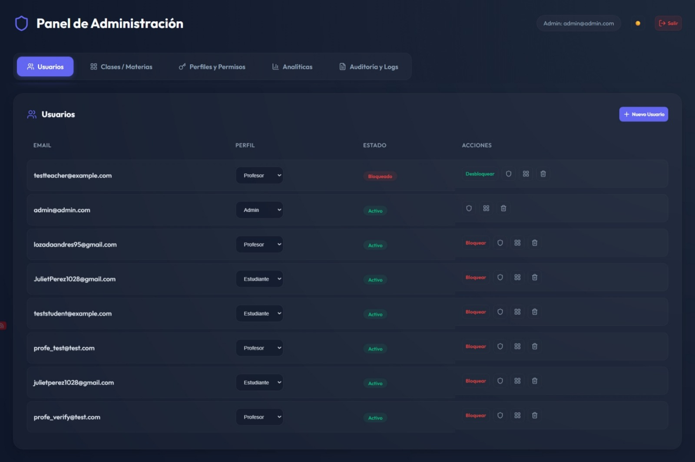 |
| Panel Admin - Clases / Materias | 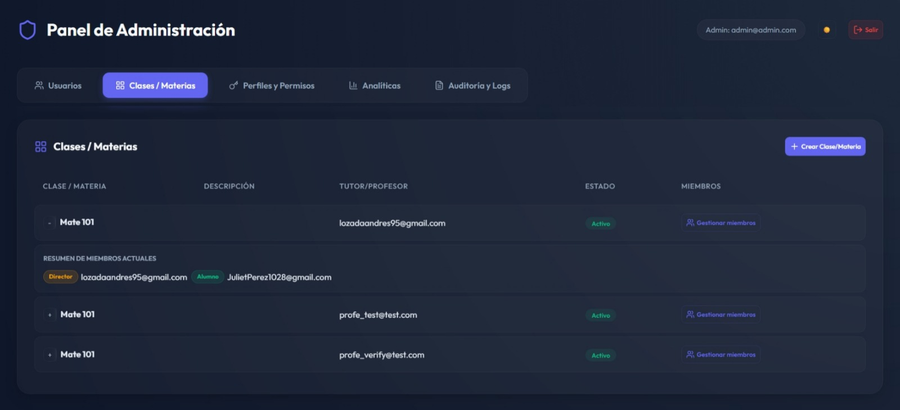 |
| Panel Admin - Perfiles y Permisos | 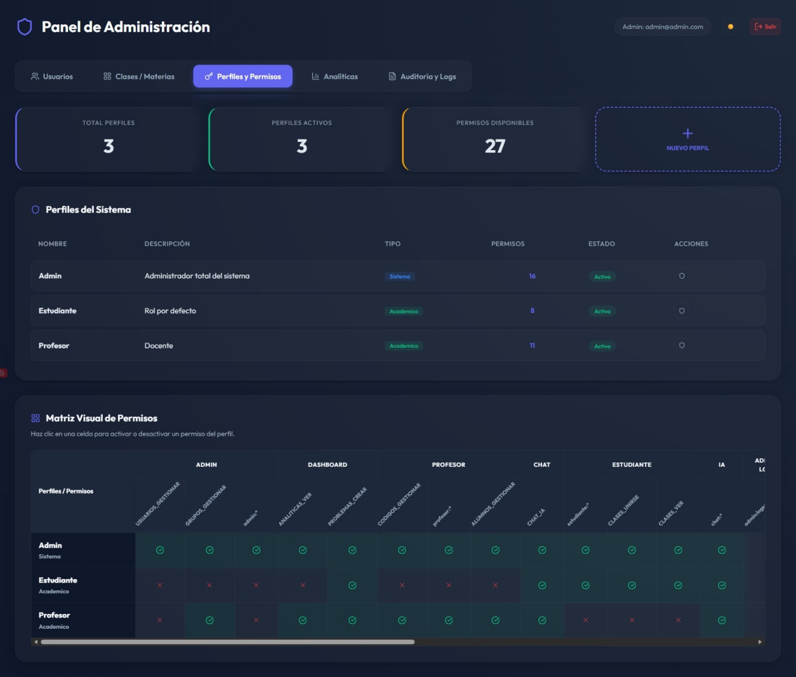 |
| Panel Admin - Analiticas | 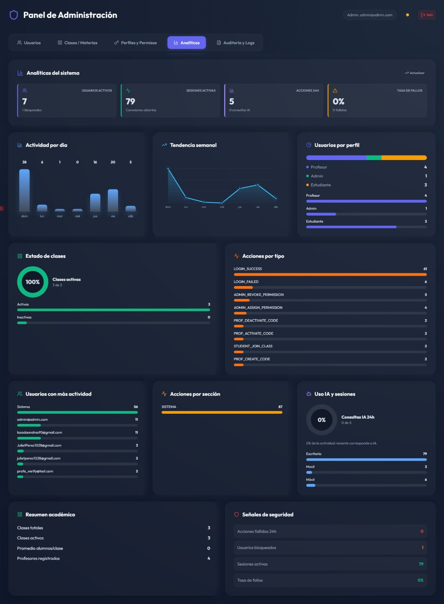 |
| Panel Profesor | 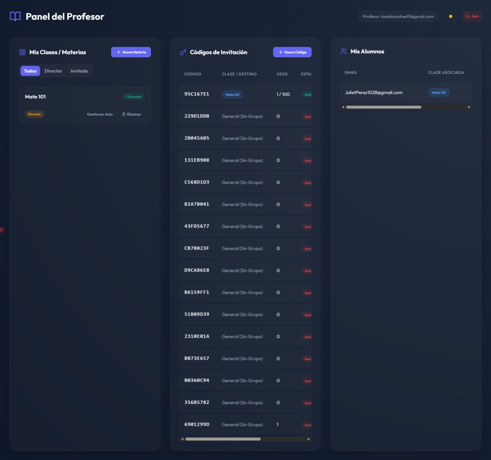 |
| Panel Profesor con permiso revocado | 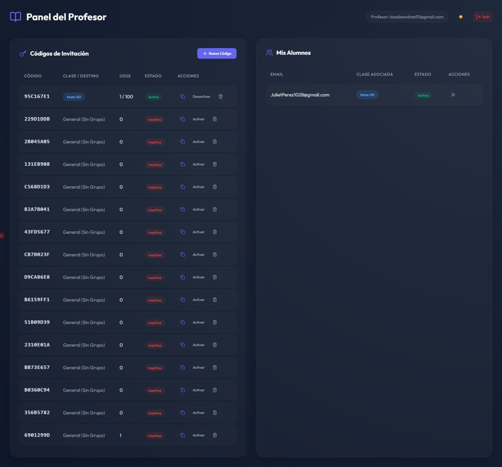 |
| Revocar permiso de gestion de grupos | 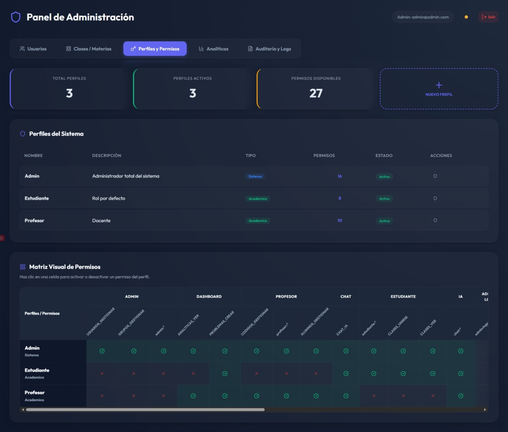 |
| Panel Estudiante | 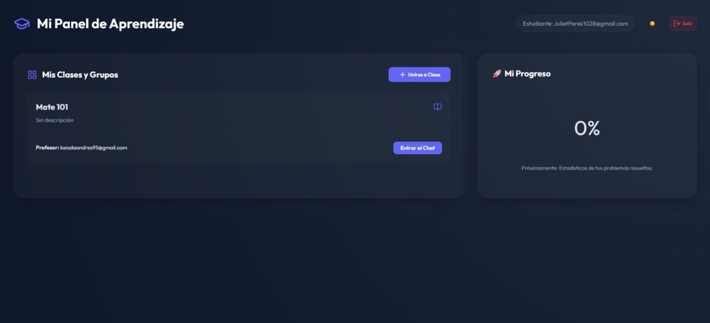 |
| Chat de Clase |  |

## Capturas historicas del chat matematico

Estas imagenes ya existen en `frontend/public/` y documentan las funciones originales del asistente matematico.

| Funcion | Captura |
|---|---|
| Inicio | 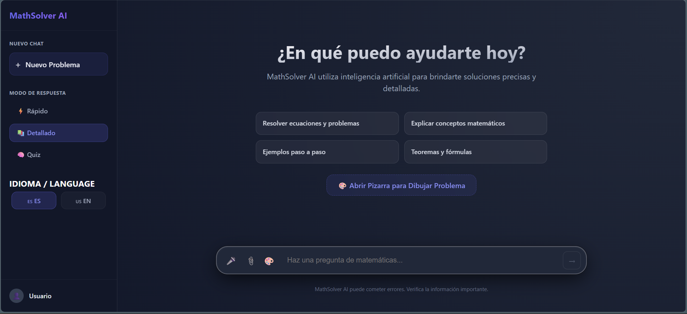 |
| Respuesta detallada con LaTeX |  |
| Pizarra | 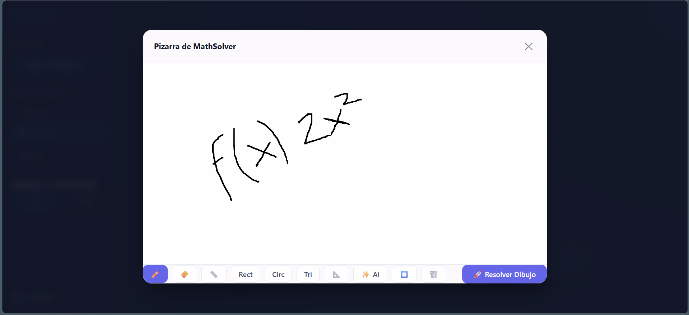 |
| Respuesta desde pizarra | 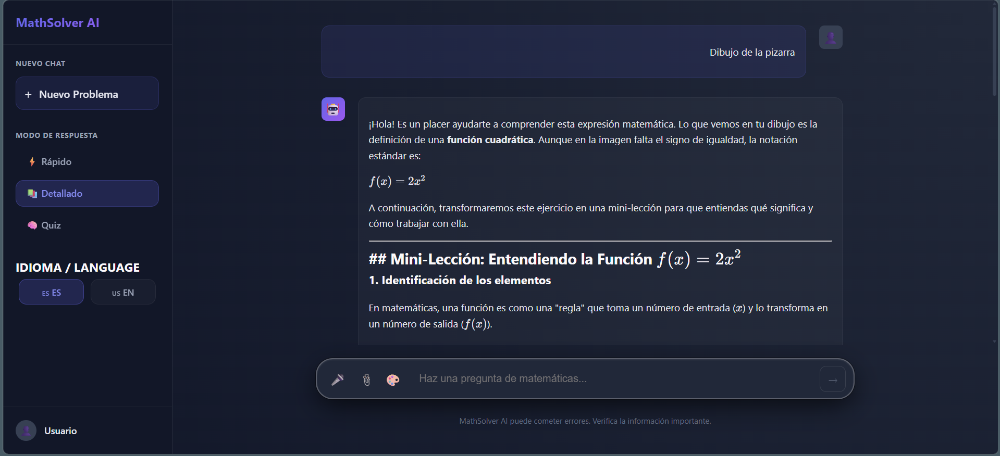 |
| Dictado de voz | 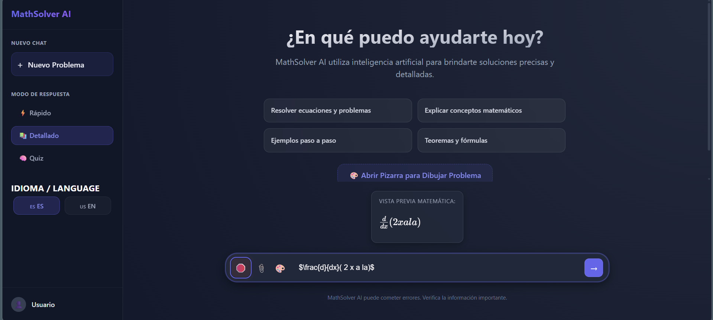 |
| OCR / Imagen |  |
| Multi-idioma |  |

## Modulos del sistema

### Administrador

El administrador puede gestionar usuarios, bloquear o desbloquear cuentas, cambiar perfiles globales, crear clases/materias, revisar miembros, administrar permisos y consultar logs de seguridad. La matriz visual de permisos permite activar o desactivar capacidades por perfil sin tocar codigo.

### Profesor

El profesor gestiona sus clases/materias, genera codigos de invitacion, activa o elimina codigos, revisa estudiantes inscritos y administra el aula cuando tiene el cargo contextual necesario. Las acciones disponibles se ocultan o bloquean segun los permisos activos en RBAC dinamico.

### Estudiante

El estudiante puede unirse a clases mediante codigos, ver sus clases inscritas y entrar al chat de IA contextual. El backend valida que el estudiante pertenezca a la clase antes de usar el contexto del grupo.

### Chat IA

El chat soporta preguntas matematicas por texto, imagen, pizarra y voz. Tambien maneja modos de respuesta rapido, detallado y quiz, renderizado matematico con KaTeX, graficas con Plotly y exportacion de resultados.

## Seguridad y permisos

| Capa | Estado | Descripcion |
|---|---|---|
| RBAC | Implementado | Permisos dinamicos por perfil desde base de datos. |
| ReBAC | Implementado | Relaciones usuario-recurso para cargos dentro de clases. |
| ABAC | Implementado base | Reglas por atributos, como horarios o contexto de peticion. |
| PBAC | Implementado base | Politicas de negocio para cupos, propiedad y restricciones. |
| Auditoria | Implementado | Registro de acciones, sesiones, clientes, fallos y denegaciones. |

## Endpoints destacados

- `POST /api/auth/login`
- `GET /api/auth/me`
- `POST /api/chat`
- `POST /api/chat-with-file`
- `GET /api/profesor/grupos`
- `POST /api/profesor/grupos`
- `DELETE /api/profesor/grupos/:id`
- `GET /api/admin/logs/acciones`
- `GET /api/admin/logs/sesiones`
- `GET /api/admin/logs/stats`
- `GET /api/admin/dashboard/analytics`
- `GET /api/documentos/:id`

## Instalacion

```bash
git clone https://github.com/lozadandres/MathSolver_AI-V3.git
cd MathSolver_AI-V3
npm install
```

Crea un archivo `.env` en la raiz con las variables necesarias:

```env
PORT=3000
DB_NAME=mathsolver
DB_USER=postgres
DB_PASSWORD=password
DB_HOST=localhost
DB_PORT=5432
OPENAI_API_KEY=tu_clave_de_gemini
JWT_SECRET=tu_secreto_jwt
```

> Nota: la variable `OPENAI_API_KEY` se mantiene por compatibilidad historica, pero el valor esperado es una clave valida para Google Gemini.

## Ejecucion local

Backend:

```bash
node app.js
```

Frontend:

```bash
cd frontend
npm install
npm run dev
```

Por defecto, el frontend usa `VITE_API_URL` o `http://localhost:3000/api`.

## Pruebas y verificacion

Backend, pruebas de seguridad:

```bash
npm run test:security
```

Frontend, lint:

```bash
cd frontend
npm run lint
```

## Nota para produccion

El proyecto ya tiene una base solida para control de acceso y auditoria, pero para un despliegue SaaS real se recomienda complementar con migraciones formales de base de datos, gestion segura de secretos, HTTPS obligatorio, backups, rate limiting, observabilidad, politicas de retencion de logs y pruebas end-to-end de seguridad.

## Licencia

MIT.
